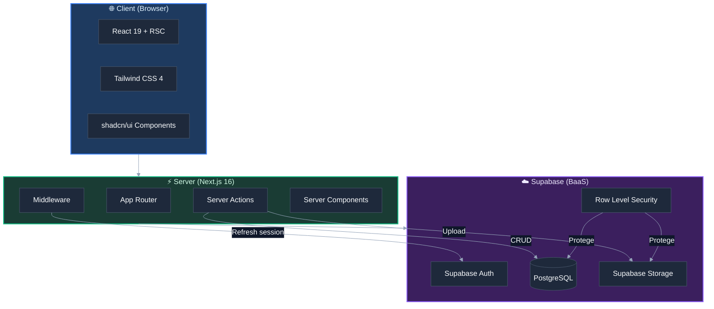
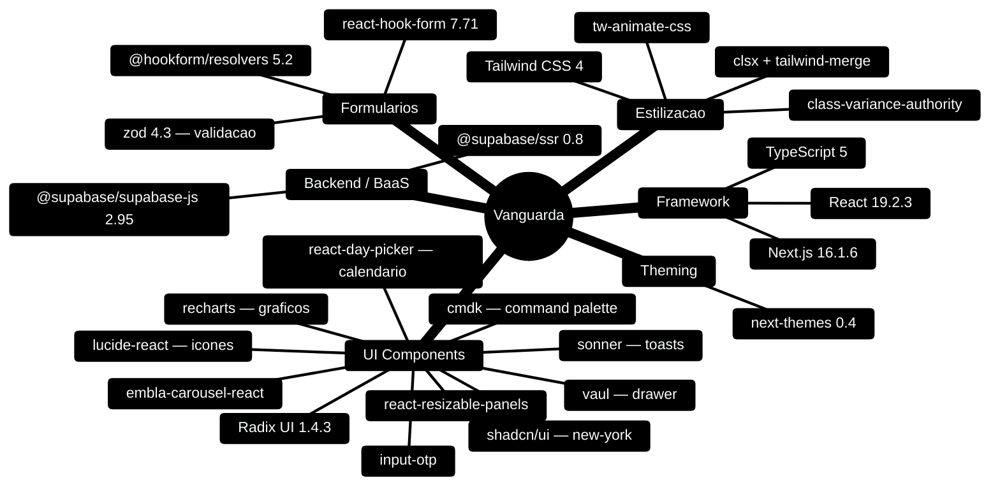
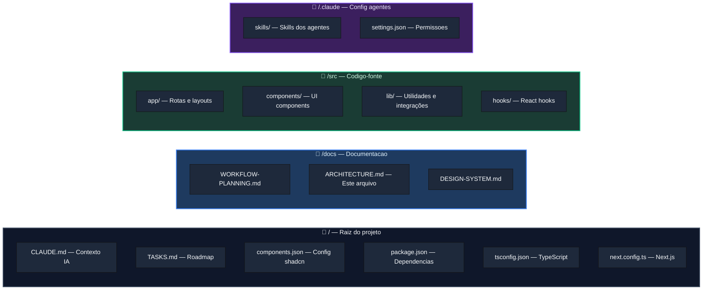
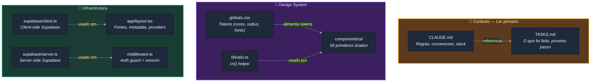
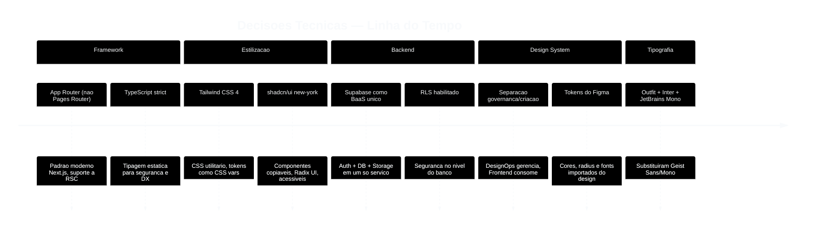
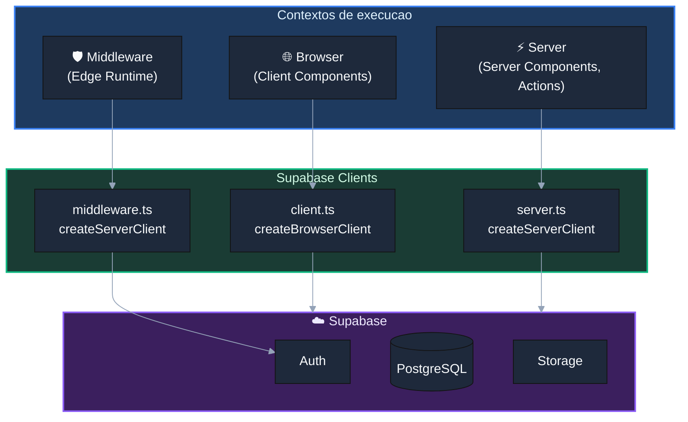
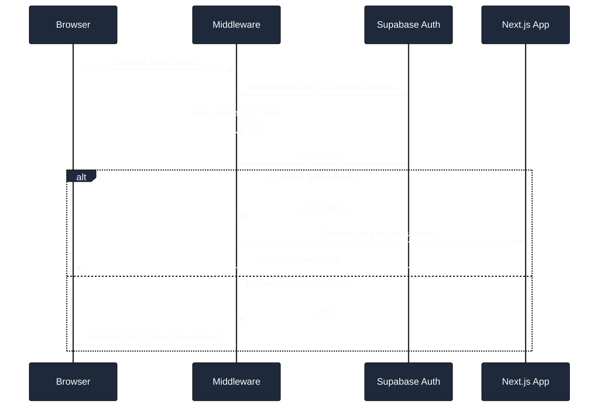
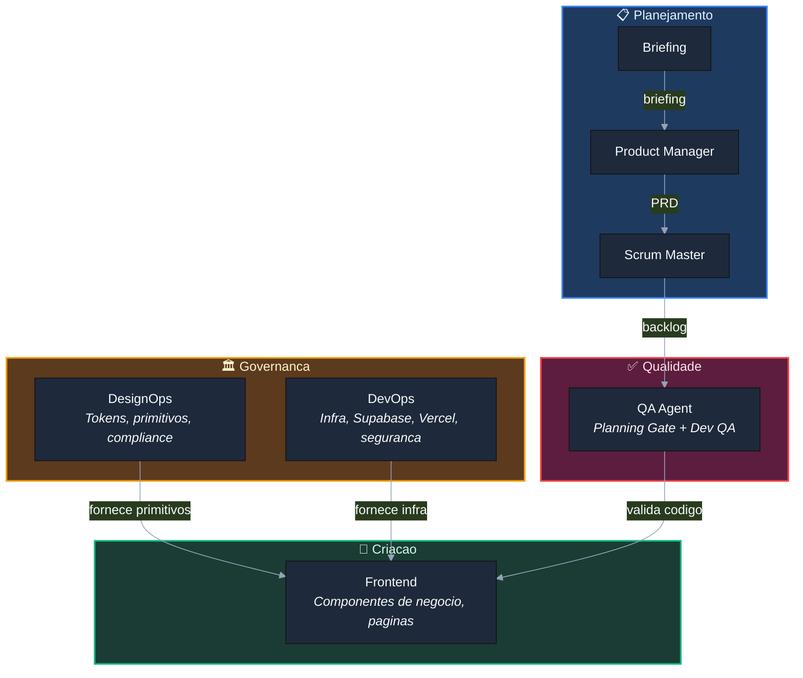

# Arquitetura do Projeto Vanguarda

> Guia completo da stack, estrutura de arquivos, dependencias e decisoes tecnicas.
> Este documento e a primeira leitura obrigatoria para qualquer agente IA ao iniciar uma sessao.

---

## Visao Geral

Vanguarda e uma aplicacao web fullstack moderna (greenfield) construida com a stack **Next.js + Supabase + shadcn/ui**. O projeto segue uma arquitetura de agentes IA especializados, onde cada agente tem responsabilidades bem definidas e opera sobre artefatos especificos.



---

## Stack Tecnologica

### Dependencias de Producao



### Tabela de dependencias

| Categoria | Pacote | Versao | Proposito |
|-----------|--------|--------|-----------|
| **Framework** | `next` | 16.1.6 | Framework fullstack com App Router |
| | `react` / `react-dom` | 19.2.3 | Biblioteca de UI com Server Components |
| **Estilizacao** | `tailwindcss` | 4.x | CSS utilitario |
| | `tw-animate-css` | 1.4.0 | Animacoes para shadcn/ui |
| | `class-variance-authority` | 0.7.1 | Variantes de componentes |
| | `clsx` | 2.1.1 | Merge condicional de classes |
| | `tailwind-merge` | 3.5.0 | Resolve conflitos de classes Tailwind |
| **UI** | `radix-ui` | 1.4.3 | Primitivos acessiveis (base do shadcn) |
| | `lucide-react` | 0.575.0 | Biblioteca de icones |
| | `cmdk` | 1.1.1 | Command palette |
| | `vaul` | 1.1.2 | Drawer (mobile-first) |
| | `sonner` | 2.0.7 | Toast notifications |
| | `embla-carousel-react` | 8.6.0 | Carousel |
| | `react-resizable-panels` | 4.6.5 | Paineis redimensionaveis |
| | `recharts` | 2.15.4 | Graficos e charts |
| | `react-day-picker` | 9.14.0 | Date picker |
| | `input-otp` | 1.4.2 | Input OTP (verificacao) |
| | `next-themes` | 0.4.6 | Dark mode toggle |
| **BaaS** | `@supabase/supabase-js` | 2.95.3 | Client Supabase (auth, db, storage) |
| | `@supabase/ssr` | 0.8.0 | Supabase para SSR (cookies) |
| **Forms** | `react-hook-form` | 7.71.2 | Gerenciamento de formularios |
| | `@hookform/resolvers` | 5.2.2 | Resolvers para validacao |
| | `zod` | 4.3.6 | Schema validation |
| **Dev** | `shadcn` | 3.8.5 | CLI para instalar componentes |
| | `eslint` + `eslint-config-next` | 9.x | Linting |
| | `typescript` | 5.x | Tipagem estatica |

### Runtime

| Ferramenta | Versao |
|------------|--------|
| Node.js | v25.6.0 |
| npm | 11.8.0 |

---

## Estrutura de Diretorios



### Mapa completo de arquivos

```
vanguarda/
│
├── .claude/                          # Configuracao dos agentes IA
│   ├── settings.json                 # Permissoes de ferramentas
│   ├── agents/                       # Agentes especializados
│   │   ├── devops.md                 # Arquiteto DevOps Fullstack
│   │   ├── designops.md              # Gestor de governanca do DS
│   │   ├── frontend.md               # Especialista em UI
│   │   ├── storybook-expert.md       # Especialista em Storybook
│   │   ├── pm.md                     # Product Manager
│   │   ├── sm.md                     # Scrum Master
│   │   └── qa.md                     # QA Agent (Planning Gate + Dev QA)
│   ├── agent-memory/                 # Memoria persistente dos agentes
│   │   ├── storybook-expert/         # Memoria do Storybook Expert
│   │   └── qa/                       # Memoria do QA Agent
│   └── skills/                       # Skills invocaveis por slash commands
│       ├── auth-guard/SKILL.md       # /auth-guard — protecao de rotas
│       ├── db-migration/SKILL.md     # /db-migration — migrations Supabase
│       ├── deploy/SKILL.md           # /deploy — deploy Vercel
│       ├── designops/SKILL.md        # /designops — governanca do DS
│       ├── devops/SKILL.md           # /devops — infra e arquitetura
│       ├── ds-components/SKILL.md    # /ds-components — catalogo de primitivos
│       ├── ds-foundations/SKILL.md   # /ds-foundations — tokens e foundations
│       ├── ds-manage/SKILL.md        # /ds-manage — gerencia do DS
│       ├── new-component/SKILL.md    # /new-component — cria componente
│       ├── new-page/SKILL.md         # /new-page — cria pagina
│       ├── qa/SKILL.md              # /qa — QA generico
│       ├── qa-a11y/SKILL.md         # /qa-a11y — auditoria acessibilidade
│       ├── qa-audit/SKILL.md        # /qa-audit — auditoria completa
│       ├── qa-gate/SKILL.md         # /qa-gate — validacao de artefatos
│       ├── qa-perf/SKILL.md         # /qa-perf — auditoria performance
│       ├── qa-security/SKILL.md     # /qa-security — auditoria seguranca
│       ├── qa-test/SKILL.md         # /qa-test — testes e cobertura
│       ├── review/SKILL.md           # /review — code review
│       └── status/SKILL.md           # /status — status do projeto
│
├── docs/                             # Documentacao do projeto
│   ├── ARCHITECTURE.md               # ★ Este arquivo
│   ├── DESIGN-SYSTEM.md              # Documentacao do Design System
│   └── WORKFLOW-PLANNING.md          # Workflow de planejamento
│
├── src/
│   ├── app/                          # Next.js App Router
│   │   ├── globals.css               # ★ Tokens do Design System (CSS vars)
│   │   ├── layout.tsx                # ★ Root layout (fontes, metadata)
│   │   ├── page.tsx                  # Homepage
│   │   ├── auth/
│   │   │   ├── actions.ts            # Server Actions (login, signup, logout)
│   │   │   └── callback/route.ts     # Callback de confirmacao de email
│   │   ├── dashboard/
│   │   │   ├── page.tsx              # Pagina do dashboard (protegida)
│   │   │   └── actions.ts            # Server Actions do dashboard
│   │   ├── login/page.tsx            # Pagina de login
│   │   └── signup/page.tsx           # Pagina de cadastro
│   │
│   ├── components/
│   │   └── ui/                       # ★ 56 primitivos shadcn/ui (GOVERNANCA)
│   │       ├── button.tsx
│   │       ├── card.tsx
│   │       ├── input.tsx
│   │       └── ... (56 arquivos)
│   │
│   ├── hooks/
│   │   └── use-mobile.ts             # Hook de deteccao mobile
│   │
│   └── lib/
│       ├── utils.ts                  # ★ cn() — helper de classes
│       └── supabase/
│           ├── client.ts             # ★ Supabase client (browser)
│           ├── server.ts             # ★ Supabase client (server)
│           ├── middleware.ts          # Supabase middleware (session)
│           ├── database.types.ts     # Types gerados do schema
│           ├── storage.ts            # Funcoes de storage (upload, etc)
│           └── queries/
│               └── profiles.ts       # Queries da tabela profiles
│
├── middleware.ts → src/middleware.ts  # ★ Middleware Next.js (auth + session)
│
├── CLAUDE.md                         # ★ Contexto principal para agentes IA
├── TASKS.md                          # ★ Roadmap e tracking de progresso
├── components.json                   # Config do shadcn/ui CLI
├── package.json                      # Dependencias e scripts
├── tsconfig.json                     # Config TypeScript
└── next.config.ts                    # Config Next.js
```

---

## Arquivos Criticos (Leitura Obrigatoria)

Estes sao os arquivos que todo agente deve conhecer. Estao marcados com ★ no mapa acima.



### Descricao de cada arquivo critico

| Arquivo | Importancia | Quem modifica |
|---------|-------------|---------------|
| `CLAUDE.md` | **Fonte de verdade** do projeto. Regras, convencoes, stack definida, decisoes tecnicas. Todo agente le na inicializacao. | Qualquer agente (com cuidado) |
| `TASKS.md` | **Roadmap** do projeto. Tracking do que foi feito e o que falta. Deve estar sempre atualizado. | Qualquer agente ao concluir tarefa |
| `globals.css` | **Tokens do DS**. CSS variables que definem cores, radius, fonts, spacing. Base visual de toda a aplicacao. | Apenas DesignOps |
| `lib/utils.ts` | Helper `cn()` que combina `clsx` + `tailwind-merge`. Usado em todos os componentes. | Raramente modificado |
| `components/ui/` | **56 primitivos shadcn/ui**. Base do DS. Nunca editados manualmente — instalados via CLI. | Apenas DesignOps via CLI |
| `supabase/client.ts` | Client Supabase para **browser** (Client Components). Tipado com `Database`. | DevOps |
| `supabase/server.ts` | Client Supabase para **server** (Server Components, Server Actions). Tipado com `Database`. | DevOps |
| `middleware.ts` | Middleware Next.js. Refresh de sessao Supabase + protecao de rotas autenticadas. | DevOps |
| `app/layout.tsx` | Root layout. Carrega fontes (Outfit, Inter, JetBrains Mono), define metadata. | Frontend / DesignOps |

---

## Decisoes Tecnicas

Decisoes ja tomadas e suas justificativas. Servem como lei — nao devem ser revertidas sem discussao explicita.



### Detalhamento das decisoes

| # | Decisao | Alternativa descartada | Justificativa |
|---|---------|------------------------|---------------|
| 1 | **App Router** | Pages Router | Padrao moderno do Next.js, suporte nativo a Server Components |
| 2 | **TypeScript strict** | JavaScript | Tipagem estatica previne bugs, melhora DX com autocomplete |
| 3 | **Tailwind CSS 4** | CSS Modules, Styled Components | Utilitario, zero-runtime, tokens como CSS vars nativos |
| 4 | **Supabase como BaaS unico** | Firebase, Auth0 + Prisma | Simplifica infra: auth + db + storage em um servico |
| 5 | **shadcn/ui (new-york)** | Material UI, Chakra UI | Componentes copiaveis, customizaveis, Radix UI acessivel |
| 6 | **Separacao governanca/criacao** | Agente unico para DS | Evita conflitos: quem define tokens != quem usa tokens |
| 7 | **Componentes por dominio** | Pasta plana | `components/dashboard/`, `components/auth/` organiza por contexto |
| 8 | **Tokens do Figma** | Tokens genericos shadcn | Fidelidade ao design: cores, radius e fonts do Figma |
| 9 | **Server Components como padrao** | Client Components | Performance: menos JS no browser, melhor LCP |
| 10 | **RLS no Supabase** | Auth apenas no middleware | Seguranca em profundidade: protecao no nivel do banco |

---

## Configuracao do TypeScript

```
tsconfig.json
├── target: ES2017
├── strict: true
├── module: esnext
├── moduleResolution: bundler
├── jsx: react-jsx
├── paths: @/* → ./src/*
└── plugins: ["next"]
```

O alias `@/*` mapeia para `./src/*`, permitindo imports como:
```typescript
import { cn } from "@/lib/utils"
import { Button } from "@/components/ui/button"
import { createClient } from "@/lib/supabase/server"
```

---

## Configuracao do shadcn/ui

Arquivo: `components.json`

```
components.json
├── style: new-york
├── rsc: true (Server Components)
├── tsx: true (TypeScript)
├── css: src/app/globals.css
├── baseColor: neutral
├── cssVariables: true
├── iconLibrary: lucide
└── aliases:
    ├── @/components
    ├── @/components/ui
    ├── @/lib
    ├── @/lib/utils
    └── @/hooks
```

---

## Supabase — Arquitetura de Clients

O Supabase exige clients diferentes dependendo do contexto de execucao:



| Client | Arquivo | Quando usar | Cookie handling |
|--------|---------|-------------|-----------------|
| **Browser** | `lib/supabase/client.ts` | Client Components (`"use client"`) | Automatico via browser |
| **Server** | `lib/supabase/server.ts` | Server Components, Server Actions, Route Handlers | Via `cookies()` do Next.js |
| **Middleware** | `lib/supabase/middleware.ts` | `middleware.ts` (refresh de sessao) | Via `request.cookies` |

Todos os clients sao tipados com `Database` generic para type-safety:
```typescript
import type { Database } from "./database.types"
createServerClient<Database>(url, key, { cookies })
```

---

## Middleware e Protecao de Rotas

O middleware (`src/middleware.ts`) executa em **toda requisicao** e faz duas coisas:

1. **Refresh de sessao** — Chama `updateSession()` para manter cookies Supabase atualizados
2. **Protecao de rotas** — Verifica autenticacao para rotas em `protectedRoutes`



**Rotas protegidas atuais:** `/dashboard*`

**Matcher:** Exclui assets estaticos (`_next/static`, `_next/image`, `favicon.ico`, imagens).

---

## Banco de Dados (Supabase PostgreSQL)

### Schema atual

| Tabela | Descricao | RLS |
|--------|-----------|-----|
| `profiles` | Perfis de usuario (linked com `auth.users`) | SELECT, UPDATE, INSERT por `auth.uid()` |

### Triggers

| Trigger | Funcao | Descricao |
|---------|--------|-----------|
| `on_auth_user_created` | `handle_new_user()` | Cria profile automaticamente ao signup (SECURITY DEFINER) |
| `on_profiles_updated` | `set_updated_at()` | Atualiza `updated_at` em cada UPDATE |

### Storage

| Bucket | Acesso | Limite | Tipos |
|--------|--------|--------|-------|
| `avatars` | Publico | 2MB | image/jpeg, png, webp, gif |

Politicas: INSERT, UPDATE, DELETE, SELECT — todas por `auth.uid()` (cada usuario so acessa seus proprios arquivos).

---

## Scripts Disponiveis

```bash
npm run dev      # Servidor de desenvolvimento (hot reload)
npm run build    # Build de producao
npm run start    # Serve o build de producao
npm run lint     # ESLint
```

---

## Variaveis de Ambiente

Arquivo: `.env.local` (nunca comitado)

| Variavel | Descricao | Onde usar |
|----------|-----------|-----------|
| `NEXT_PUBLIC_SUPABASE_URL` | URL do projeto Supabase | Client + Server |
| `NEXT_PUBLIC_SUPABASE_ANON_KEY` | Chave anonima (publica) | Client + Server |

> Variaveis com prefixo `NEXT_PUBLIC_` sao expostas ao browser. Chaves secretas (service_role) NUNCA devem ter este prefixo.

---

## Mapa de Agentes IA



| Agente | Dominio | O que controla | Skills |
|--------|---------|----------------|--------|
| **DesignOps** | Governanca | `globals.css`, `components/ui/`, tokens | `/designops`, `/ds-manage`, `/ds-foundations`, `/ds-components` |
| **DevOps** | Governanca | Supabase, Vercel, middleware, seguranca | `/devops`, `/db-migration`, `/deploy`, `/auth-guard` |
| **Frontend** | Criacao | Componentes de negocio, paginas, layouts | `/new-component`, `/new-page` |
| **Briefing** | Planejamento | Discovery e briefing do projeto | `/briefing` |
| **PM** | Planejamento | PRD e epicos | `/pm` |
| **SM** | Planejamento | Stories e tasks | `/backlog` |
| **QA** | Qualidade | Planning Gate + testes + a11y + perf + seguranca | `/qa`, `/qa-gate`, `/qa-test`, `/qa-a11y`, `/qa-perf`, `/qa-security`, `/qa-audit` |
| **Storybook Expert** | Documentacao | Stories, docs, interaction tests, a11y | `/storybook-expert`, `/sb-story`, `/sb-docs`, `/sb-test`, `/sb-a11y`, `/sb-audit` |

---

## Performance Web — Alvos

| Metrica | Alvo | Estrategia |
|---------|------|------------|
| **LCP** | < 2.5s | Server Components, `next/image`, `next/font` |
| **CLS** | < 0.1 | Dimensoes explicitas em imagens, fontes pre-carregadas |
| **INP** | < 200ms | Minimizar JS no client, evitar hydration desnecessaria |

### Regras de performance

- Server Components como padrao — Client Components apenas com interatividade (`onClick`, `useState`, etc.)
- `next/image` para todas as imagens (otimizacao automatica)
- `next/font` para fontes (elimina FOIT/FOUT)
- Queries Supabase com `select()` seletivo — nunca `select('*')`
- Minimizar bundle JS do client

---

## Checklist de Onboarding (para agentes IA)

Ao iniciar uma nova sessao, o agente deve:

1. ☐ Ler `CLAUDE.md` (regras e contexto)
2. ☐ Ler `TASKS.md` (estado atual do projeto)
3. ☐ Ler `docs/BACKLOG.md` quando existir (fonte de verdade do backlog)
4. ☐ Identificar qual agente esta sendo invocado (governanca vs criacao)
5. ☐ Consultar skills relevantes antes de agir

---

> Ultima atualizacao: 2026-02-27
