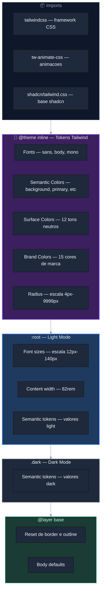
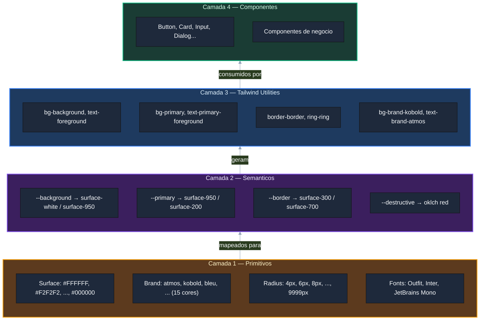
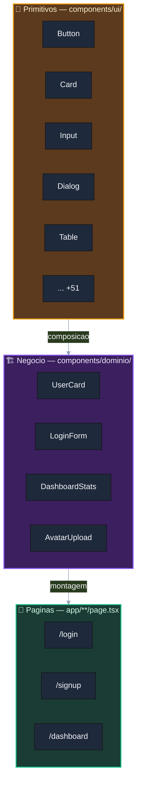
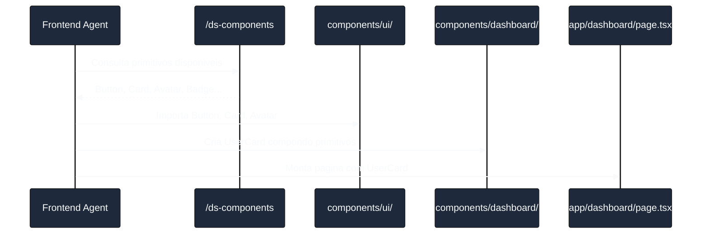
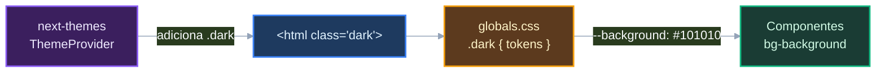
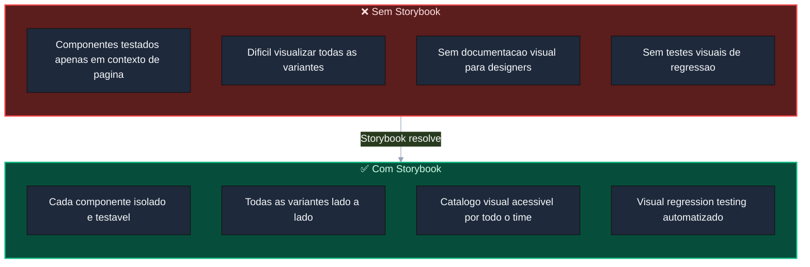
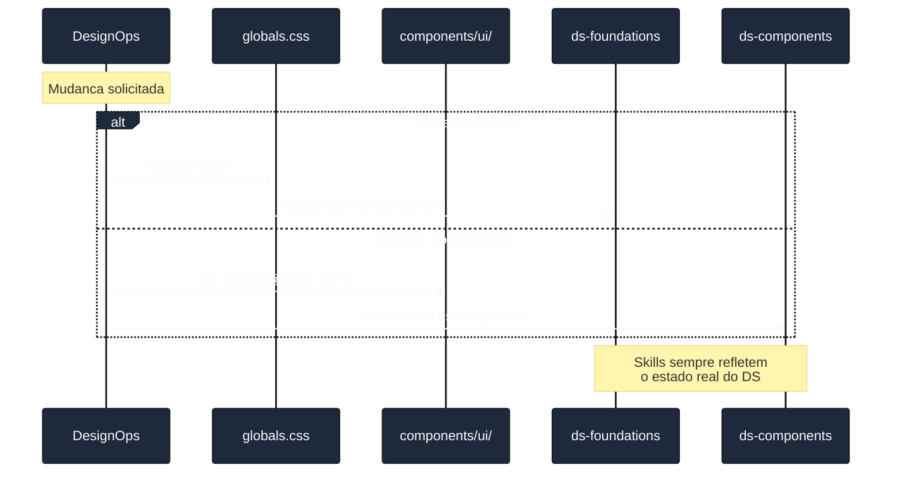

# Design System — Projeto Vanguarda

> Documentacao completa do Design System: arquitetura, tokens, componentes, governanca vs criacao, e Storybook.
> Este documento explica **como** o DS funciona e **por que** cada decisao foi tomada.

---

## Principio Fundamental: Governanca vs Criacao

O Design System do Vanguarda segue uma separacao rigida entre **quem define** e **quem usa**. Isso evita conflitos, garante consistencia e permite que agentes especializados trabalhem em paralelo sem pisar no trabalho um do outro.

```mermaid
%%{init: {'theme': 'base', 'themeVariables': {'primaryColor': '#1e293b', 'primaryTextColor': '#f8fafc', 'primaryBorderColor': '#475569', 'lineColor': '#94a3b8', 'secondaryColor': '#0f172a'}}}%%

graph LR
    subgraph GOV [" 🏛️ GOVERNANCA — DesignOps "]
        direction TB
        G1["globals.css<br/><i>Tokens: cores, radius, fonts</i>"]
        G2["components/ui/<br/><i>56 primitivos shadcn</i>"]
        G3["components.json<br/><i>Config do shadcn CLI</i>"]
        G4["Storybook<br/><i>Catalogo visual</i>"]
    end

    subgraph CREATE [" 🔨 CRIACAO — Frontend "]
        direction TB
        C1["components/dashboard/<br/><i>Componentes do dominio</i>"]
        C2["components/auth/<br/><i>Componentes de auth</i>"]
        C3["components/shared/<br/><i>Componentes reutilizaveis</i>"]
        C4["app/**/page.tsx<br/><i>Paginas e layouts</i>"]
    end

    GOV -->|"fornece tokens e primitivos"| CREATE
    CREATE -.->|"NUNCA modifica"| GOV

    style GOV fill:#5c3a1e,stroke:#f59e0b,stroke-width:3px,color:#fef3c7
    style CREATE fill:#1a3c34,stroke:#10b981,stroke-width:3px,color:#d1fae5
```



### Regras da separacao

| Regra | DesignOps | Frontend |
|-------|:---------:|:--------:|
| Editar `globals.css` (tokens) | ✅ | ❌ |
| Editar `components/ui/*` | ❌ (via CLI apenas) | ❌ |
| Instalar primitivos shadcn | ✅ (`/ds-manage add`) | ❌ |
| Criar componentes de negocio | ❌ | ✅ (`/new-component`) |
| Criar paginas | ❌ | ✅ (`/new-page`) |
| Alterar tokens | ✅ (`/ds-manage update-tokens`) | ❌ |
| Auditar compliance | ✅ (`/ds-manage audit`) | ❌ |
| Consultar tokens/componentes | ✅ | ✅ (read-only) |

### Por que separar?

1. **Consistencia** — Um unico agente (DesignOps) controla os tokens. Sem risco de cores ou fonts divergentes.
2. **Seguranca** — Primitivos shadcn nunca sao editados manualmente. A CLI garante compatibilidade com Radix UI.
3. **Paralelismo** — Frontend pode criar componentes de negocio enquanto DesignOps atualiza tokens. Sem conflito de merge.
4. **Rastreabilidade** — Toda mudanca em tokens passa pelo DesignOps, que atualiza as skills de referencia (`ds-foundations`, `ds-components`).

---

## O Papel do `globals.css`

O arquivo `src/app/globals.css` e o **coracao do Design System**. Ele define todos os design tokens como CSS custom properties, que sao consumidos pelo Tailwind CSS 4 e pelos componentes shadcn/ui.

### Estrutura do arquivo



### Por que `globals.css` e critico?

1. **Single source of truth** — Todos os tokens vivem em um unico arquivo. Nao ha duplicacao.
2. **Tailwind CSS 4 integration** — O bloco `@theme inline` registra tokens diretamente no Tailwind, criando utilities automaticamente (`bg-surface-500`, `text-brand-kobold`, `rounded-md`).
3. **Dark mode** — Tokens semanticos tem valores diferentes em `:root` (light) e `.dark` (dark). Os componentes consomem os tokens semanticos e o dark mode funciona automaticamente.
4. **Figma alignment** — Os tokens foram importados do arquivo Figma (`Default.tokens.json`), garantindo fidelidade visual pixel-perfect.

### Camadas de tokens



**Fluxo:** Figma exporta primitivos → DesignOps mapeia para tokens semanticos em `globals.css` → Tailwind gera utilities → Componentes consomem utilities.

---

## Tokens — Referencia Completa

### Cores: Surface (neutros)

12 tons de cinza do branco absoluto ao preto absoluto. Base para todos os tokens semanticos.

```
surface-white  ████████  #FFFFFF   — Fundo claro
surface-100    ████████  #F2F2F2   — Secondary, muted
surface-200    ████████  #E7E7E7   — Borders leves
surface-300    ████████  #D4D4D4   — Border, input
surface-400    ████████  #BCBCBC   — Placeholders
surface-500    ████████  #A4A4A4   — Ring, muted text
surface-600    ████████  #5E5E5E   — Muted foreground
surface-700    ████████  #484848   — Dark borders
surface-800    ████████  #303030   — Dark secondary
surface-900    ████████  #202020   — Dark card
surface-950    ████████  #101010   — Foreground, dark bg
surface-black  ████████  #000000   — Preto absoluto
```

Uso Tailwind: `bg-surface-500`, `text-surface-950`, `border-surface-300`

### Cores: Brand (marca)

15 cores de marca importadas do Figma. Uso para acentos, CTAs, ilustracoes.

```
atmos    ████  #77C5D5   — Azul claro
kobold   ████  #006298   — Azul profundo
bleu     ████  #5691A1   — Azul medio
midori   ████  #3A913F   — Verde
sahara   ████  #D6A461   — Dourado
boreal   ████  #8B355F   — Magenta
cotta    ████  #872526   — Vermelho escuro
antar    ████  #BFE3ED   — Azul pastel
azzay    ████  #79876D   — Verde oliva
cloro    ████  #E2E99C   — Verde claro
arena    ████  #FAEDBC   — Areia
carota   ████  #F87C56   — Laranja
khewra   ████  #DC625E   — Vermelho medio
nubia    ████  #FBDD7A   — Amarelo
calla    ████  #F4C3CC   — Rosa
```

Uso Tailwind: `bg-brand-kobold`, `text-brand-atmos`, `border-brand-sahara`

### Cores: Semanticos (shadcn/ui)

Tokens que mudam entre light e dark mode automaticamente:

| Token | Light | Dark | Uso |
|-------|-------|------|-----|
| `background` | #FFFFFF | #101010 | Fundo da pagina |
| `foreground` | #101010 | #F2F2F2 | Texto principal |
| `card` | #FFFFFF | #202020 | Fundo de cards |
| `primary` | #77C5D5 (atmos) | #77C5D5 (atmos) | CTAs, enfase |
| `secondary` | #F2F2F2 | #303030 | Botoes secundarios |
| `muted` | #E7E7E7 | #303030 | Backgrounds sutis |
| `muted-foreground` | #5E5E5E | #A4A4A4 | Texto secundario |
| `accent` | #F2F2F2 | #303030 | Hover states |
| `destructive` | oklch red | oklch red | Erros, delete |
| `border` | #D4D4D4 | #484848 | Bordas |
| `input` | #D4D4D4 | #484848 | Bordas de input |
| `ring` | #A4A4A4 | #5E5E5E | Focus ring |

> **Decisao tomada:** `--primary` mapeado para atmos (#77C5D5) — brand color principal do projeto.

### Tipografia

| Familia | Fonte | CSS Variable | Tailwind | Uso |
|---------|-------|-------------|----------|-----|
| **Sans (primary)** | Outfit | `--font-outfit` | `font-sans` | Headings, navegacao |
| **Body (secondary)** | Inter | `--font-inter` | `font-body` | Corpo de texto |
| **Mono (tertiary)** | JetBrains Mono | `--font-jetbrains-mono` | `font-mono` | Codigo, dados |

Fontes carregadas via `next/font/google` no `layout.tsx` — sem FOIT/FOUT, sem flash.

### Border Radius

Escala absoluta do Figma:

| Token | Valor | Tailwind | Uso |
|-------|-------|----------|-----|
| `radius-min` | 4px | `rounded-min` | Tags, chips |
| `radius-xxs` | 6px | `rounded-xxs` | Inputs compactos |
| `radius-xs` | 8px | `rounded-xs` | Inputs padrao |
| `radius-sm` | 12px | `rounded-sm` | Cards pequenos |
| `radius-md` | 16px | `rounded-md` | Cards padrao |
| `radius-lg` | 24px | `rounded-lg` | Modais |
| `radius-xl` | 32px | `rounded-xl` | Secoes hero |
| `radius-2xl` | 48px | `rounded-2xl` | Containers feature |
| `radius-max` | 9999px | `rounded-max` | Pills, avatares |

---

## Componentes — Arquitetura

### Hierarquia



### Primitivos (`components/ui/`)

- **56 componentes** instalados via `npx shadcn@latest add`
- Baseados em **Radix UI** (acessibilidade nativa: `aria-*`, keyboard nav, focus management)
- Estilo **new-york** (mais denso e sofisticado que o default)
- Variantes via **CVA** (class-variance-authority)
- **NUNCA editados manualmente** — qualquer mudanca deve ser via DesignOps/CLI

Lista completa: accordion, alert, alert-dialog, aspect-ratio, avatar, badge, breadcrumb, button, button-group, calendar, card, carousel, chart, checkbox, collapsible, combobox, command, context-menu, dialog, direction, drawer, dropdown-menu, empty, field, form, hover-card, input, input-group, input-otp, item, kbd, label, menubar, native-select, navigation-menu, pagination, popover, progress, radio-group, resizable, scroll-area, select, separator, sheet, sidebar, skeleton, slider, sonner, spinner, switch, table, tabs, textarea, toggle, toggle-group, tooltip.

### Componentes de negocio (`components/<dominio>/`)

Organizados por dominio funcional:

```
src/components/
├── ui/          # Primitivos (GOVERNANCA — read-only)
├── auth/        # Login, signup, reset password
├── dashboard/   # Stats, charts, user info
├── shared/      # Reutilizaveis entre dominios
└── <dominio>/   # Novos dominios conforme necessidade
```

**Convencoes:**
- Named exports (`export function UserCard`, nunca `export default`)
- Props tipadas com interface TypeScript
- Use `cn()` de `@/lib/utils` para merge condicional de classes
- Composicao de primitivos, nunca copia de codigo

### Exemplo de fluxo de composicao



---

## O Papel do `cn()` Helper

Arquivo: `src/lib/utils.ts`

```typescript
import { clsx, type ClassValue } from "clsx"
import { twMerge } from "tailwind-merge"

export function cn(...inputs: ClassValue[]) {
  return twMerge(clsx(inputs))
}
```

### O que faz?

Combina duas bibliotecas:
1. **`clsx`** — Merge condicional de classes (`cn("base", condition && "extra")`)
2. **`tailwind-merge`** — Resolve conflitos de Tailwind (`cn("px-4", "px-6")` → `"px-6"`)

### Por que e essencial?

Sem `cn()`, classes Tailwind conflitantes se acumulam:
```tsx
// SEM cn() — BUG: px-4 e px-6 ambos aplicados
<div className={`px-4 ${className}`} />  // se className = "px-6", conflito!

// COM cn() — CORRETO: px-6 prevalece
<div className={cn("px-4", className)} />
```

Todo componente shadcn/ui e todo componente de negocio usa `cn()`.

---

## Dark Mode

### Como funciona

1. **Toggle:** Controlado por `next-themes` (pacote ja instalado)
2. **Classe:** Adiciona `.dark` ao `<html>` element
3. **Variante Tailwind:** `@custom-variant dark (&:is(.dark *))` em `globals.css`
4. **Tokens:** Valores semanticos mudam automaticamente entre `:root` e `.dark`



### Charts no dark mode

Os tokens de chart mudam para cores mais claras no dark mode para legibilidade:

| Token | Light (brand) | Dark (brand) |
|-------|---------------|--------------|
| `chart-1` | kobold (#006298) | atmos (#77C5D5) |
| `chart-2` | midori (#3A913F) | cloro (#E2E99C) |
| `chart-3` | sahara (#D6A461) | nubia (#FBDD7A) |
| `chart-4` | boreal (#8B355F) | calla (#F4C3CC) |
| `chart-5` | carota (#F87C56) | carota (#F87C56) |

---

## Storybook — Catalogo Visual

O Storybook e o **catalogo visual vivo** do Design System, permitindo visualizar, testar e documentar todos os componentes isoladamente. Todos os 56 primitivos shadcn/ui ja possuem stories CSF3 com interaction tests.

### Por que Storybook?



### Papel no workflow de agentes

O Storybook reforça a separacao governanca/criacao:

```mermaid
%%{init: {'theme': 'base', 'themeVariables': {'primaryColor': '#1e293b', 'primaryTextColor': '#f8fafc', 'lineColor': '#94a3b8'}}}%%

graph LR
    subgraph DESIGNOPS [" DesignOps "]
        D1["Publica primitivos<br/>no Storybook"]
        D2["Documenta variantes,<br/>props, tokens"]
        D3["Testa dark mode,<br/>acessibilidade"]
    end

    subgraph STORYBOOK [" 📖 Storybook "]
        SB["Catalogo visual<br/>Single source of truth"]
    end

    subgraph FRONTEND [" Frontend "]
        F1["Consulta o catalogo<br/>antes de compor"]
        F2["Ve variantes disponiveis<br/>sem ler codigo"]
        F3["Publica stories de<br/>componentes de negocio"]
    end

    DESIGNOPS -->|"publica"| STORYBOOK
    STORYBOOK -->|"consulta"| FRONTEND

    style DESIGNOPS fill:#5c3a1e,stroke:#f59e0b,stroke-width:2px,color:#fef3c7
    style STORYBOOK fill:#3b1f5e,stroke:#8b5cf6,stroke-width:2px,color:#ede9fe
    style FRONTEND fill:#1a3c34,stroke:#10b981,stroke-width:2px,color:#d1fae5
```



### O que o Storybook vai conter

| Secao | Conteudo | Dono |
|-------|----------|------|
| **Foundations** | Cores, tipografia, spacing, radius | DesignOps |
| **Primitivos** | 56 componentes shadcn com todas as variantes | DesignOps |
| **Componentes de negocio** | Composicoes por dominio | Frontend |
| **Paginas** | Previews de paginas completas | Frontend |

### Estrutura de stories

```
src/
├── components/
│   ├── ui/
│   │   ├── button.tsx
│   │   └── button.stories.tsx    # ← Story do primitivo (DesignOps)
│   └── dashboard/
│       ├── user-card.tsx
│       └── user-card.stories.tsx # ← Story de negocio (Frontend)
└── stories/
    └── foundations/               # ← Stories de tokens (DesignOps)
        ├── colors.stories.tsx
        ├── typography.stories.tsx
        └── spacing.stories.tsx
```

### Beneficios para o workflow IA

1. **DesignOps** pode validar visualmente que tokens estao corretos
2. **Frontend** pode consultar o catalogo antes de compor componentes
3. **QA** pode rodar visual regression tests automaticamente
4. **Storybook Deploy** como site estatico para referencia do time

---

## Skills de Referencia (Documentacao Viva)

O DS mantem duas skills que servem como documentacao viva — atualizadas a cada mudanca:

### `/ds-foundations` — Tokens e foundations

Conteudo: tipografia, paleta de cores (surface, brand, semanticos), spacing, radius, dark mode, content width.

**Quando consultar:** Antes de usar qualquer token de cor, fonte ou spacing. A skill contem os valores exatos e as classes Tailwind correspondentes.

### `/ds-components` — Catalogo de componentes

Conteudo: lista dos 56 primitivos instalados, regras de uso, exemplo de composicao, hooks auxiliares.

**Quando consultar:** Antes de criar um componente de negocio. A skill mostra quais primitivos estao disponiveis e como usa-los corretamente.

### Fluxo de atualizacao



---

## Comandos Disponiveis

| Comando | Agente | Descricao |
|---------|--------|-----------|
| `/designops <tarefa>` | DesignOps | Tarefa generica de governanca do DS |
| `/ds-manage add <comp>` | DesignOps | Instala primitivo shadcn via CLI |
| `/ds-manage audit` | DesignOps | Audita compliance do DS |
| `/ds-manage update-tokens` | DesignOps | Atualiza tokens em globals.css |
| `/ds-manage list` | DesignOps | Lista componentes instalados |
| `/ds-foundations` | Referencia | Consulta tokens e foundations |
| `/ds-components` | Referencia | Consulta catalogo de componentes |
| `/new-component <Nome>` | Frontend | Cria componente de negocio |
| `/new-page <rota>` | Frontend | Cria pagina no App Router |

---

## Decisoes Pendentes

| Questao | Status | Resultado |
|---------|--------|-----------|
| Qual brand color sera `--primary`? | Definido | atmos (#77C5D5) — brand color principal |
| Qual brand color sera `--destructive`? | Pendente | Atualmente oklch. Candidatos: cotta (#872526), khewra (#DC625E) |
| Storybook — quando instalar? | Concluido | Instalado e configurado. 56 primitivos com stories CSF3 + interaction tests |

---

> Ultima atualizacao: 2026-02-27
