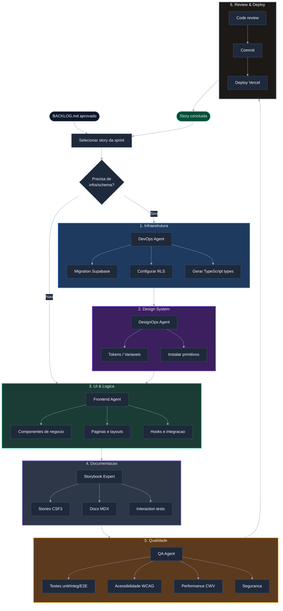
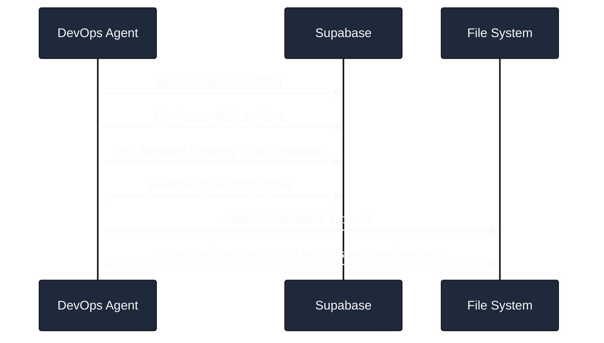
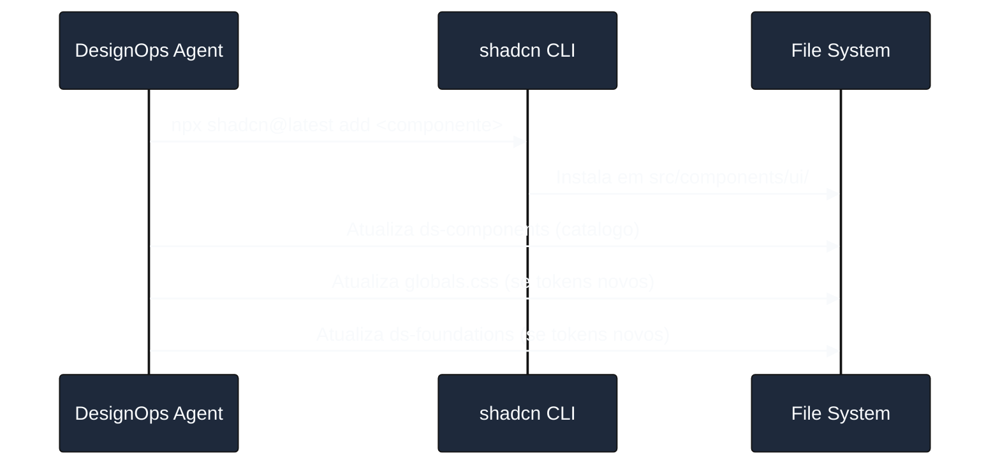
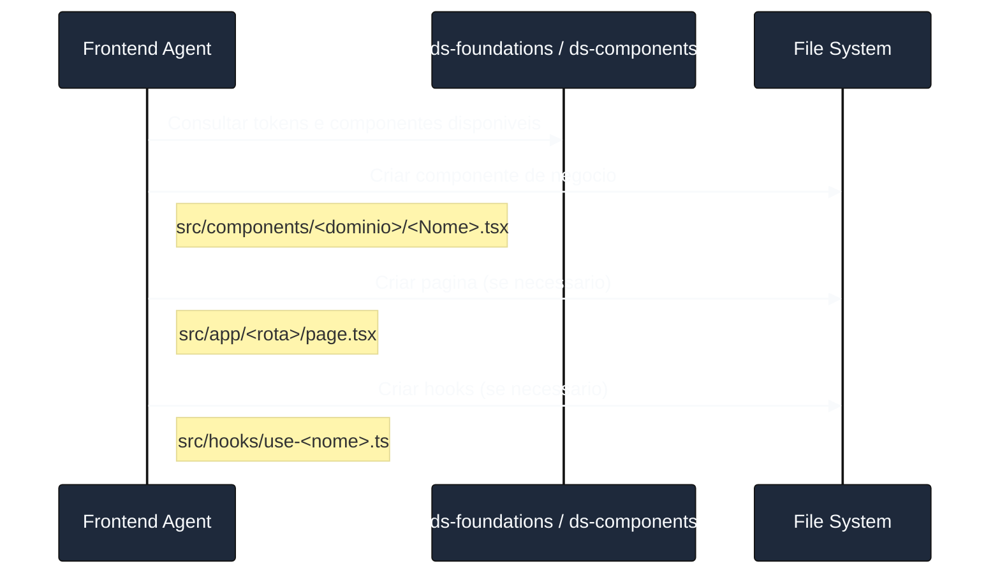
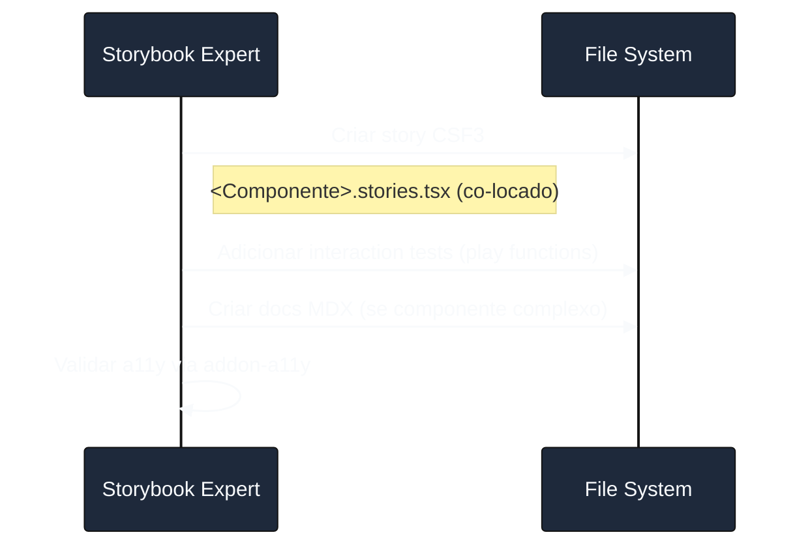
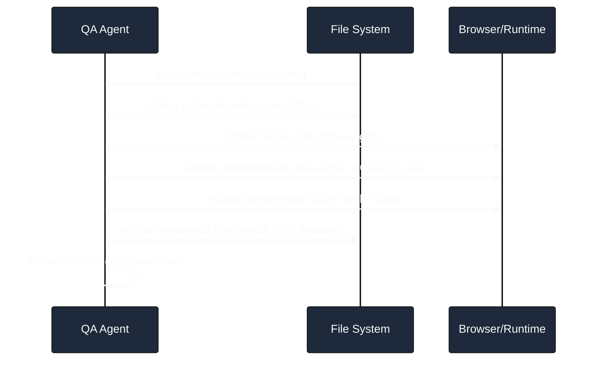
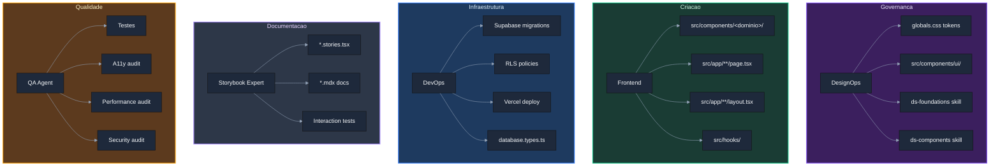
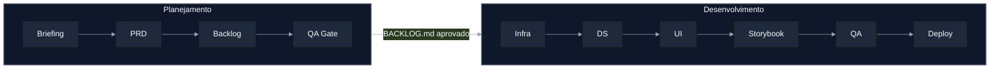

# Workflow de Desenvolvimento — Projeto Vanguarda

> Documento que descreve o processo de desenvolvimento do projeto, do backlog ao deploy.
> Complementa o `WORKFLOW-PLANNING.md` (que cobre da ideia ao backlog).

---

## Visao Geral

O workflow de desenvolvimento transforma stories do `BACKLOG.md` em codigo funcional, testado e deployado. E composto por **6 fases**, executadas por agentes especializados com separacao clara de responsabilidades.



---

## Mapa de Agentes de Desenvolvimento

```mermaid
%%{init: {'theme': 'base', 'themeVariables': {'primaryColor': '#1e293b', 'primaryTextColor': '#f8fafc', 'lineColor': '#94a3b8', 'secondaryColor': '#0f172a'}}}%%

block-beta
    columns 5

    block:infra:1
        columns 1
        A["DevOps Agent"]
        A1["DB, Deploy, Seguranca"]
    end

    block:ds:1
        columns 1
        B["DesignOps Agent"]
        B1["Tokens & Primitivos"]
    end

    block:ui:1
        columns 1
        C["Frontend Agent"]
        C1["Componentes & Paginas"]
    end

    block:sb:1
        columns 1
        D["Storybook Expert"]
        D1["Stories & Docs"]
    end

    block:qa:1
        columns 1
        E["QA Agent"]
        E1["Testes & Auditorias"]
    end

    style infra fill:#1e3a5f,stroke:#3b82f6,stroke-width:2px,color:#e0f2fe
    style ds fill:#3b1f5e,stroke:#8b5cf6,stroke-width:2px,color:#ede9fe
    style ui fill:#1a3c34,stroke:#10b981,stroke-width:2px,color:#d1fae5
    style sb fill:#2d3748,stroke:#a78bfa,stroke-width:2px,color:#e9d5ff
    style qa fill:#5c3a1e,stroke:#f59e0b,stroke-width:2px,color:#fef3c7
```



| Agente | Slug | Escopo | Nunca faz |
|--------|------|--------|-----------|
| **DevOps** | `devops` | Migrations, RLS, deploy, seguranca, performance | DROP/TRUNCATE sem confirmacao |
| **DesignOps** | `designops` | Tokens CSS, instalar primitivos shadcn, compliance DS | Criar componentes de negocio |
| **Frontend** | `frontend` | Componentes de negocio, paginas, layouts, hooks | Editar `ui/` ou tokens |
| **Storybook Expert** | `storybook-expert` | Stories CSF3, docs MDX, interaction tests, a11y | Editar `ui/` ou logica de negocio |
| **QA** | `qa` | Testes, acessibilidade, performance, seguranca | Aprovar gates sem evidencias |

---

## Fase 1 — Infraestrutura (DevOps Agent)

### Quando executar

Apenas quando a story requer alteracoes no banco de dados, storage, ou configuracoes de deploy.

### Fluxo



### Comando principal

```
/db-migration <descricao-da-migration>
```

### Regras

- Sempre usar `apply_migration` para DDL (nunca `execute_sql`)
- Sempre configurar RLS em novas tabelas
- Sempre checar advisors (seguranca + performance) apos mudancas de schema
- Nunca expor credenciais ou secrets
- Gerar TypeScript types apos cada migration

---

## Fase 2 — Design System (DesignOps Agent)

### Quando executar

Quando a story necessita de novos primitivos UI ou ajustes em tokens.

### Fluxo



### Comandos principais

```
/ds-manage add <componente>      # Instalar primitivo shadcn
/ds-manage audit                 # Auditar compliance do DS
/ds-manage update-tokens         # Atualizar tokens
```

### Regras

- Primitivos instalados **apenas** via CLI shadcn (nunca manualmente)
- Tokens vivem exclusivamente em `src/app/globals.css`
- Documentar alteracoes nas skills `ds-foundations` e `ds-components`
- Frontend **nunca** edita `src/components/ui/` — solicita via `/ds-manage`

---

## Fase 3 — UI e Logica (Frontend Agent)

### Quando executar

Sempre — toda story que envolve interface passa por esta fase.

### Fluxo



### Comandos principais

```
/new-component <NomeComponente>  # Criar componente de negocio
/new-page <rota>                 # Criar pagina Next.js
```

### Regras

- **Server Components** como padrao (`"use client"` apenas com interatividade)
- Named exports, TypeScript strict, apenas Tailwind para estilos
- Sempre exportar `metadata` em paginas
- Usar `getUser()` (nunca `getSession()`) para verificar autenticacao
- Componentes de negocio em `src/components/<dominio>/`
- Consultar `ds-foundations` e `ds-components` antes de criar UI

### Estrutura de componentes

```
src/components/
├── ui/                    # Primitivos shadcn (GOVERNANCA — nao editar)
├── dashboard/             # Componentes do dominio dashboard
├── auth/                  # Componentes do dominio auth
├── shared/                # Componentes reutilizaveis entre dominios
└── <novo-dominio>/        # Conforme necessidade da story
```

---

## Fase 4 — Documentacao (Storybook Expert)

### Quando executar

Apos criar ou modificar componentes — toda UI publica deve ter stories.

### Fluxo



### Comandos principais

```
/sb-story <NomeComponente>       # Criar stories CSF3
/sb-test <NomeComponente>        # Adicionar interaction tests
/sb-docs <NomeComponente>        # Criar documentacao MDX
/sb-a11y <NomeComponente>        # Auditar acessibilidade no Storybook
/sb-audit                        # Auditar cobertura de stories
```

### Regras

- Sempre CSF3 (nunca CSF2)
- Story co-locada ao lado do componente: `<Nome>.stories.tsx`
- Sempre incluir `tags: ['autodocs']` e `satisfies Meta<typeof Component>`
- Layout: `'centered'` para componentes pequenos, `'padded'` para maiores
- Nunca modificar `src/components/ui/`

---

## Fase 5 — Qualidade (QA Agent)

### Quando executar

Antes de commitar — toda mudanca significativa deve passar por QA.

### Fluxo



### Comandos principais

```
/qa-test all                     # Rodar todos os testes
/qa-test coverage                # Verificar cobertura de codigo
/qa-a11y <pagina>                # Auditar acessibilidade
/qa-perf <pagina>                # Auditar Core Web Vitals
/qa-security                     # Auditar seguranca
/qa-audit                        # Auditoria completa (tudo acima)
```

### Piramide de testes (Testing Trophy)

```
Prioridade: Integration > Unit > E2E > Static
```

| Tipo | Ferramenta | Cobertura alvo |
|------|-----------|----------------|
| Unit | Vitest | 80% global / 90% critico |
| Integration | React Testing Library | 80% global / 90% critico |
| E2E | Playwright | Fluxos criticos |
| A11y | axe-core | WCAG 2.1 AA |
| Performance | Lighthouse CI | LCP < 2.5s, CLS < 0.1, INP < 200ms |

### Severidades

Cada issue recebe uma severidade: **critical**, **alto**, **medium**, **low**. O QA sempre sugere correcoes concretas.

---

## Fase 6 — Review e Deploy

### Code Review

```
/review                          # Review antes de commit
```

O review verifica: TypeScript, React patterns, Tailwind, Supabase, seguranca e convencoes do projeto.

### Deploy

O DevOps Agent gerencia deploys via Vercel MCP:


---

## Separacao de Responsabilidades

### Quem faz o que



### Fronteiras criticas

| Fronteira | Regra |
|-----------|-------|
| Frontend → DesignOps | Frontend **nunca** edita `src/components/ui/` nem tokens. Usa `/ds-manage`. |
| DevOps → Producao | **Nunca** DROP/TRUNCATE sem confirmacao explicita do usuario. |
| QA → Aprovacao | **Nunca** aprova sem evidencias (output de comandos, numeros, codigo). |
| Storybook → Logica | **Nunca** modifica logica de negocio. Apenas documenta e testa UI isolada. |

---

## Referencia Rapida de Comandos

### Desenvolvimento

| Comando | O que faz | Agente |
|---------|-----------|--------|
| `/new-component <Nome>` | Cria componente de negocio | Frontend |
| `/new-page <rota>` | Cria pagina Next.js | Frontend |
| `/db-migration <desc>` | Cria migration Supabase | DevOps |
| `/ds-manage add <comp>` | Instala primitivo shadcn | DesignOps |
| `/ds-manage audit` | Audita compliance do DS | DesignOps |
| `/auth-guard` | Adiciona protecao de autenticacao | DevOps |

### Documentacao

| Comando | O que faz | Agente |
|---------|-----------|--------|
| `/sb-story <Nome>` | Cria stories CSF3 | Storybook Expert |
| `/sb-test <Nome>` | Adiciona interaction tests | Storybook Expert |
| `/sb-docs <Nome>` | Cria docs MDX | Storybook Expert |
| `/sb-setup` | Instala Storybook 8.x | Storybook Expert |

### Qualidade

| Comando | O que faz | Agente |
|---------|-----------|--------|
| `/review` | Code review antes de commit | -- |
| `/qa-test all` | Roda todos os testes | QA |
| `/qa-a11y <page>` | Audita acessibilidade | QA |
| `/qa-perf <page>` | Audita performance | QA |
| `/qa-security` | Audita seguranca | QA |
| `/qa-audit` | Auditoria completa | QA |

### Gestao

| Comando | O que faz | Agente |
|---------|-----------|--------|
| `/status` | Estado atual do projeto | -- |
| `/progress` | Progresso do backlog | SM |
| `/sprint` | Planeja/reorganiza sprints | SM |
| `/refine` | Refina stories do backlog | SM |

---

## Exemplo: Desenvolvendo uma Story Completa

Supondo a story: *"Como usuario, quero editar meu perfil para atualizar minhas informacoes"*

```
1. Ler story no BACKLOG.md → entender criterios de aceitacao
2. /db-migration add-profile-fields        → DevOps cria migration se necessario
3. /ds-manage add dialog                   → DesignOps instala Dialog se nao existe
4. /new-component ProfileForm              → Frontend cria formulario
5. /new-page dashboard/profile             → Frontend cria pagina
6. /sb-story ProfileForm                   → Storybook documenta componente
7. /sb-test ProfileForm                    → Storybook adiciona interaction tests
8. /qa-test all                            → QA roda testes
9. /qa-a11y dashboard/profile              → QA verifica acessibilidade
10. /review                                → Code review final
11. Commit e deploy
12. Atualizar status no BACKLOG.md
```

---

## Relacao com o Workflow de Planejamento

Este workflow **comeca onde o planejamento termina**:



- **Entrada:** `docs/BACKLOG.md` aprovado pelo QA Gate
- **Saida:** Feature funcional, testada e deployada
- **Feedback:** Se durante o desenvolvimento surgir necessidade de mudanca no escopo, o fluxo retorna ao planejamento (PM ou SM)

---

> Ultima atualizacao: 2026-02-27
