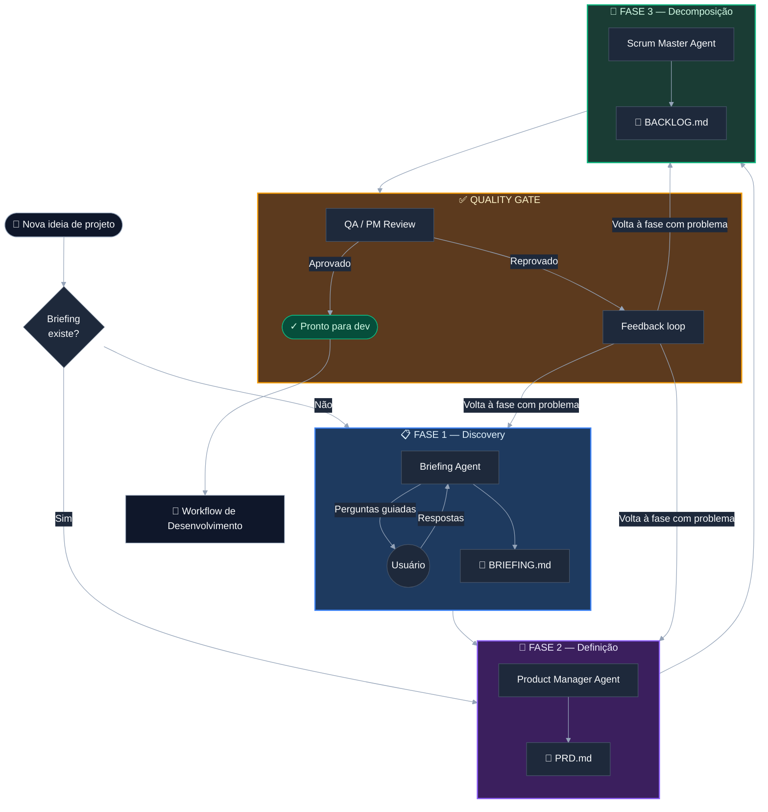
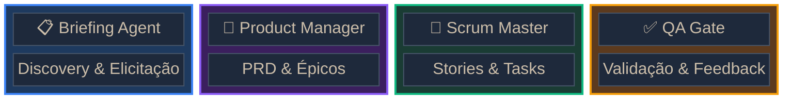
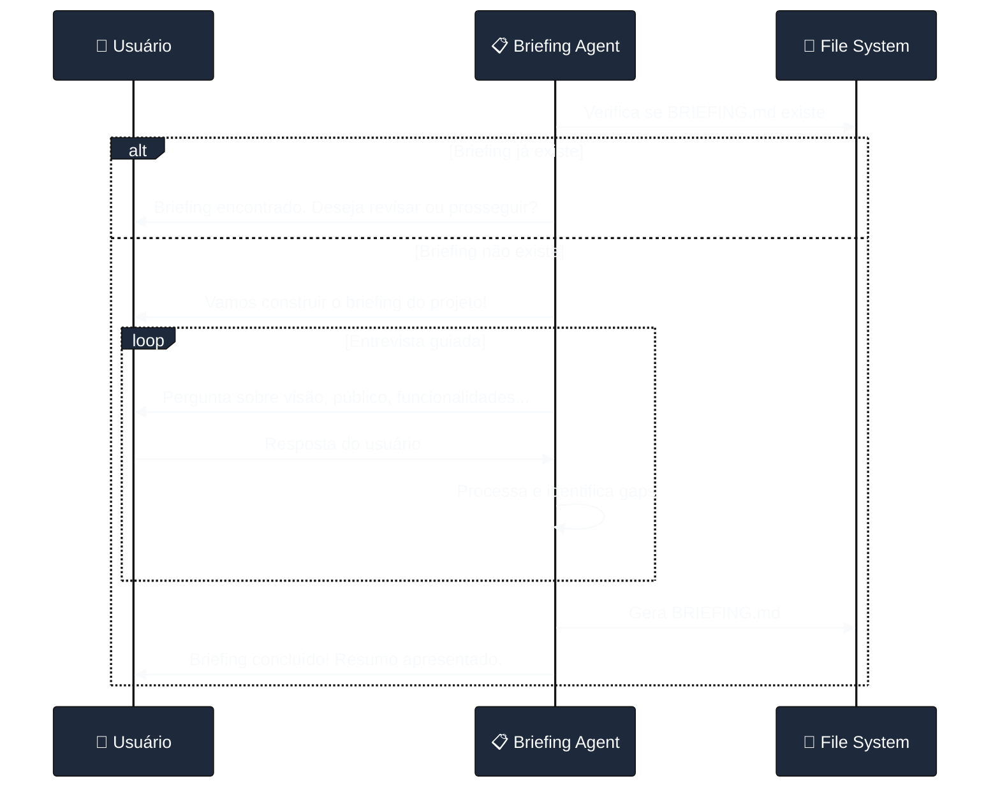
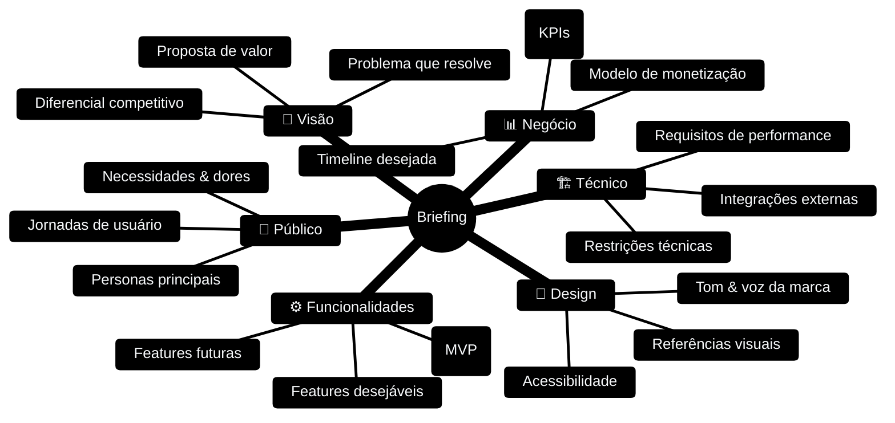
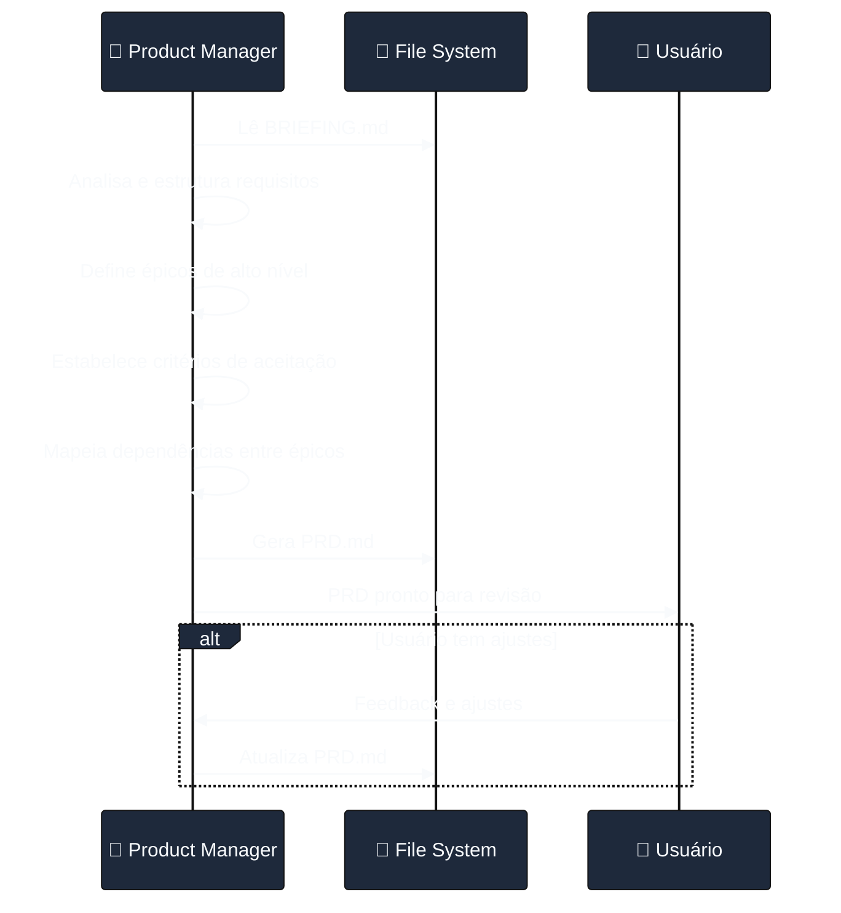
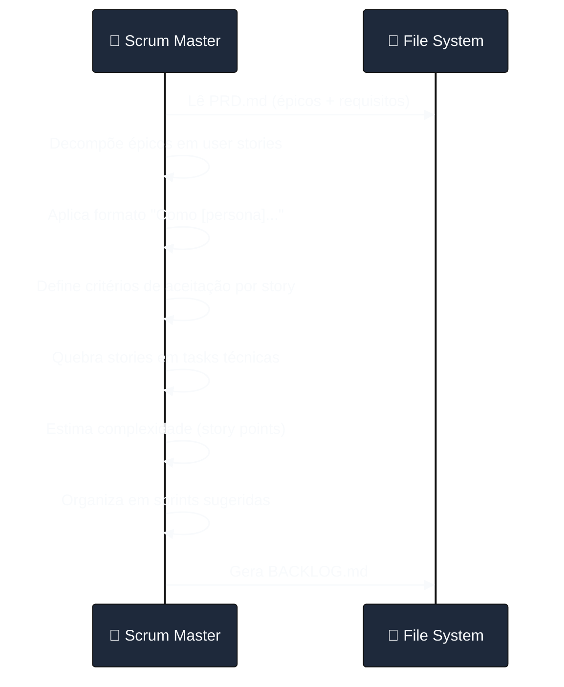
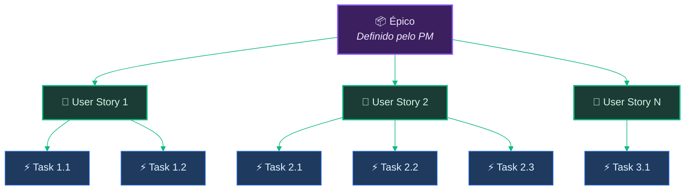
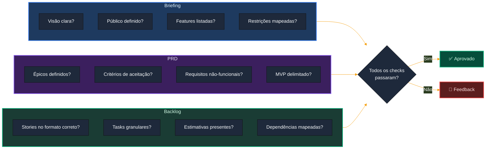
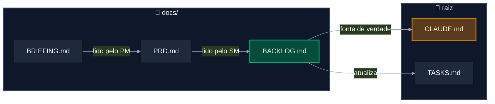

# Workflow de Planejamento — Projeto Vanguarda

> Documento que descreve o processo de planejamento e preparação de projetos antes do desenvolvimento.
> Este workflow transforma uma ideia bruta em um backlog estruturado e pronto para execução.

---

## Visão Geral

O workflow de planejamento é composto por **4 fases sequenciais** + **1 quality gate**, executadas por agentes especializados. Cada fase produz um artefato que alimenta a próxima, garantindo rastreabilidade e qualidade.

---

## Mapa de Agentes

Cada fase é executada por um agente especializado com responsabilidades bem definidas.

| Agente | Slug | Responsabilidade | Input | Output |
|--------|------|------------------|-------|--------|
| **Briefing** | `briefing` | Conduzir discovery com o usuário, fazer perguntas estratégicas | Ideia bruta do usuário | `BRIEFING.md` |
| **Product Manager** | `pm` | Traduzir briefing em PRD profissional, definir épicos | `BRIEFING.md` | `PRD.md` + Épicos |
| **Scrum Master** | `sm` | Decompor PRD em stories e tasks seguindo Agile/Scrum | `PRD.md` | `BACKLOG.md` |
| **QA Gate** | `qa-gate` | Validar qualidade e completude de todos os artefatos | Todos os artefatos | Aprovação ou Feedback |

---

## Fase 1 — Discovery (Briefing Agent)

### Objetivo

Transformar uma ideia vaga em um briefing estruturado e detalhado. O agente conduz uma entrevista guiada com o usuário.

### Fluxo detalhado

### Conhecimentos do agente

- **Stack técnica:** Next.js (App Router), TypeScript, Tailwind CSS, Supabase (Auth + DB + Storage), shadcn/ui
- **Gestão de projetos:** Sabe fazer as perguntas certas para extrair requisitos
- **UX/Produto:** Entende personas, jornadas de usuário, MVP vs produto completo

### Categorias de perguntas

O Briefing Agent cobre **6 dimensões**:

### Artefato de saída: `BRIEFING.md`

Localização: `docs/BRIEFING.md`

Estrutura esperada:
- Visão do projeto
- Público-alvo e personas
- Funcionalidades (core, desejáveis, futuras)
- Requisitos técnicos e integrações
- Métricas de sucesso
- Restrições e premissas
- Referências visuais e de UX

---

## Fase 2 — Definição (Product Manager Agent)

### Objetivo

Traduzir o briefing em um **PRD (Product Requirements Document)** profissional, com épicos e critérios de aceitação claros.

### Fluxo detalhado

### Responsabilidades do PM

- Traduzir linguagem de negócio em requisitos técnicos
- Definir **épicos** (agrupamentos de alto nível)
- Estabelecer **critérios de aceitação** por épico
- Priorizar features (MoSCoW ou similar)
- Identificar riscos e dependências
- Definir escopo do MVP vs releases futuras

### Artefato de saída: `PRD.md`

Localização: `docs/PRD.md`

Estrutura esperada:
- Resumo executivo
- Objetivos e métricas de sucesso
- Personas e jornadas
- Épicos com descrição e critérios de aceitação
- Requisitos não-funcionais (performance, segurança, acessibilidade)
- Arquitetura de alto nível
- Riscos e mitigações
- Cronograma de releases (MVP → V1 → V2)

---

## Fase 3 — Decomposição (Scrum Master Agent)

### Objetivo

Decompor o PRD em **stories** e **tasks** granulares, prontas para desenvolvimento, seguindo metodologia Agile/Scrum.

### Fluxo detalhado

### Hierarquia Agile

### Divisão de responsabilidades

| Nível | Quem define | Formato |
|-------|-------------|---------|
| **Épico** | Product Manager | Título + descrição + critérios de aceitação |
| **User Story** | Scrum Master | "Como [persona], quero [ação] para [benefício]" |
| **Task** | Scrum Master | Tarefa técnica granular, executável em horas |

### Artefato de saída: `BACKLOG.md`

Localização: `docs/BACKLOG.md`

Estrutura esperada:
- Épicos (herdados do PRD)
  - User Stories por épico
    - Critérios de aceitação
    - Story points (estimativa)
    - Tasks técnicas
  - Dependências entre stories
- Sugestão de sprints
- Definition of Done (DoD)

---

## Fase 4 — Quality Gate

### Objetivo

Validar que todos os artefatos estão completos, consistentes e prontos para alimentar o workflow de desenvolvimento.

### Checklist de validação

### Critérios de aprovação

| Artefato | Critério | Obrigatório |
|----------|----------|:-----------:|
| `BRIEFING.md` | Todas as 6 dimensões preenchidas | ✅ |
| `BRIEFING.md` | Sem ambiguidades ou contradições | ✅ |
| `PRD.md` | Pelo menos 1 épico definido | ✅ |
| `PRD.md` | Cada épico com critérios de aceitação | ✅ |
| `PRD.md` | MVP claramente delimitado | ✅ |
| `PRD.md` | Requisitos não-funcionais presentes | ✅ |
| `BACKLOG.md` | Stories no formato "Como X, quero Y para Z" | ✅ |
| `BACKLOG.md` | Cada story com pelo menos 1 task | ✅ |
| `BACKLOG.md` | Estimativas em story points | ⚠️ |
| `BACKLOG.md` | Sprints sugeridas | ⚠️ |

### Feedback loop

Quando o QA Gate reprova, ele:
1. Identifica exatamente **qual artefato** tem problema
2. Descreve **o que está faltando ou inconsistente**
3. Aponta **qual agente** precisa corrigir
4. O fluxo retorna à fase correspondente

---

## Fluxo de Arquivos

### Relação entre artefatos

- **`BRIEFING.md`** → Input para o PM. Contém a visão crua do projeto.
- **`PRD.md`** → Input para o SM. Contém requisitos estruturados e épicos.
- **`BACKLOG.md`** → **Fonte de verdade** do projeto. O Claude lê este arquivo (via `CLAUDE.md`) para saber:
  - Onde estamos no projeto
  - Quais são os próximos passos
  - Status de cada story/task
- **`CLAUDE.md`** → Referencia `BACKLOG.md` como handoff principal.
- **`TASKS.md`** → Mantido em sync com o backlog para tracking rápido.

---

## Ciclo de Vida Completo

```mermaid
%%{init: {'theme': 'base', 'themeVariables': {'primaryColor': '#1e293b', 'primaryTextColor': '#f8fafc', 'lineColor': '#94a3b8'}}}%%

stateDiagram-v2
    [*] --> Ideação: Nova ideia

    state "📋 Discovery" as Discovery {
        [*] --> VerificaBriefing
        VerificaBriefing --> EntrevistaUsuario: Não existe
        VerificaBriefing --> ProssegueComExistente: Já existe
        EntrevistaUsuario --> GeraBriefing
        GeraBriefing --> [*]
        ProssegueComExistente --> [*]
    }

    state "📐 Definição" as Definicao {
        [*] --> AnalisaBriefing
        AnalisaBriefing --> EstruturaRequisitos
        EstruturaRequisitos --> DefineEpicos
        DefineEpicos --> GeraPRD
        GeraPRD --> [*]
    }

    state "🔨 Decomposição" as Decomposicao {
        [*] --> LePRD
        LePRD --> CriaStories
        CriaStories --> CriaTasks
        CriaTasks --> EstimaComplexidade
        EstimaComplexidade --> OrganizaSprints
        OrganizaSprints --> GeraBacklog
        GeraBacklog --> [*]
    }

    state "✅ Quality Gate" as QualityGate {
        [*] --> ValidaBriefing
        ValidaBriefing --> ValidaPRD
        ValidaPRD --> ValidaBacklog
        ValidaBacklog --> Veredicto
        Veredicto --> [*]: Aprovado
        Veredicto --> FeedbackLoop: Reprovado
        FeedbackLoop --> [*]
    }

    Ideação --> Discovery
    Discovery --> Definicao
    Definicao --> Decomposicao
    Decomposicao --> QualityGate
    QualityGate --> Desenvolvimento: Aprovado
    QualityGate --> Discovery: Feedback (briefing)
    QualityGate --> Definicao: Feedback (PRD)
    QualityGate --> Decomposicao: Feedback (backlog)
    Desenvolvimento --> [*]
```

---

## Resumo dos Skills/Commands

Após a criação dos agentes, os seguintes comandos estarão disponíveis:

| Comando | Agente | Descrição |
|---------|--------|-----------|
| `/briefing` | Briefing | Inicia ou revisa o briefing do projeto |
| `/prd` | Product Manager | Gera PRD a partir do briefing |
| `/backlog` | Scrum Master | Decompõe PRD em stories e tasks |
| `/qa-gate` | QA Gate | Valida todos os artefatos de planejamento |

---

## Próximos passos

Os agentes descritos neste documento precisam ser criados. As tarefas estão registradas em `TASKS.md` na seção **"Fase 7 — Workflow de Planejamento (Agentes)"**.

Após a criação dos agentes de planejamento, será criado um segundo documento: **`WORKFLOW-DEVELOPMENT.md`** — descrevendo o fluxo de desenvolvimento (coding, review, testing, deploy).

---

> Última atualização: 2026-02-27
